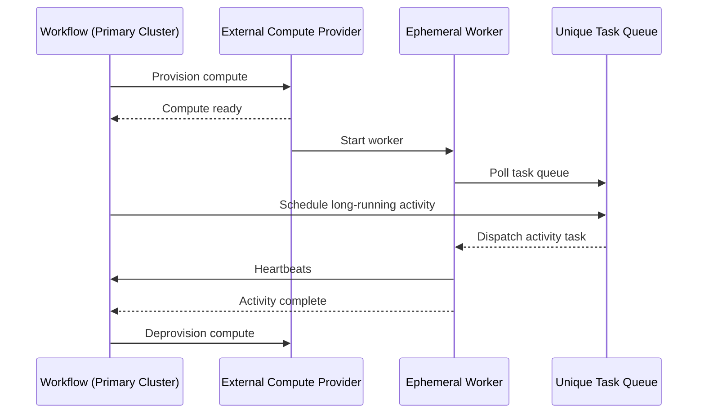

# temporal-external-activity

A Temporal workflow that offloads a long-running, resource-intensive activity to
external compute.

<!-- toc -->

* [Architecture](#architecture)
* [Why use this pattern?](#why-use-this-pattern)
* [How to run this example](#how-to-run-this-example)
  * [Build your external Docker image](#build-your-external-docker-image)
  * [Configuration](#configuration)
  * [Running](#running)
* [Contributing](#contributing)
  * [Open in a container](#open-in-a-container)
  * [Commit style](#commit-style)

<!-- Regenerate with "pre-commit run -a markdown-toc" -->

<!-- tocstop -->

This is a proof of concept for a customer who runs long-running, resource-intensive
jobs. They want to keep their primary Temporal cluster optimised for day-to-day
workflows, while offloading heavy workloads to separate, external compute.

This is very useful for data processing jobs which run to completion.

The workflow:
1. provisions an external compute resource
1. starts a Temporal worker on that resource
1. schedules an activity on a unique task queue that only that worker listens to
1. deprovisions the compute resource once processing is complete

The compute resource can be any external compute - an Azure Container App, an
AWS Batch job, any VM or a DigitalOcean App (as in this case).

The external worker listens on a unique task queue created specifically for this
workflow execution. This ensures that only this workflow can dispatch work to that
worker, while keeping the systems loosely coupled.

The external worker registers only activities, not workflows. It exists solely
to process this workload and is terminated afterwards, making it effectively
ephemeral.

Because the external activity is long-running, it emits regular heartbeats.
This allows Temporal to detect failures promptly and retry or fail the workflow
according to its retry policy.

## Architecture

This pattern separates orchestration from heavy execution:
* The primary Temporal cluster runs the workflow logic.
* The workflow provisions external compute on demand.
* A short-lived Temporal worker runs on that compute.
* The worker listens on a unique task queue.
* The worker executes a long-running activity and heartbeats.
* Once complete, the compute resource is destroyed.

This allows resource-intensive jobs to run without impacting the main cluster.



## Why use this pattern?

* Isolates resource-intensive workloads
* Avoids over-provisioning the primary cluster
* Keeps orchestration and execution concerns separate
* Maintains full Temporal guarantees: retries, heartbeats and observability

## How to run this example

You will need a running [Temporal cluster](https://cloud.temporal.io) and a
[DigitalOcean](https://digitalocean.com) account.

### Build your external Docker image

You'll need `<IMAGE_REGISTRY>` and `<IMAGE_REPOSITORY>` later on.

1. Build the image

   ```sh
   docker build \
     --platform linux/amd64 \
     -t registry.digitalocean.com/<IMAGE_REGISTRY>/<IMAGE_REPOSITORY> .
   ```

1. Now, push to the DigitalOcean registry

   ```sh
   docker push registry.digitalocean.com/<IMAGE_REGISTRY>/<IMAGE_REPOSITORY>
   ```

### Configuration

You will need the following environment variables configured:

* `DIGITALOCEAN_ACCESS_TOKEN` - DO token with read/write access

You will also need to specify the [Temporal environment variables](https://docs.temporal.io/references/client-environment-configuration).
A typical configuration would be:

* `TEMPORAL_NAMESPACE`
* `TEMPORAL_ADDRESS`
* `TEMPORAL_TLS`
* `TEMPORAL_API_KEY`

Finally, set the details for your DigitalOcean image repository

* `IMAGE_REGISTRY`: The DO registry name, defaults to `sje-test-registry`
* `IMAGE_REPOSITORY`: The repository name, defaults to `external`
* `IMAGE_TAG`: The image tag, defaults to `latest`

### Running

First, start your worker:

```sh
cd ./workflow/worker
go run .
```

Now, trigger the workflow:

```sh
cd ./workflow/starter
go run .
```

## Contributing

### Open in a container

* [Open in a container](https://code.visualstudio.com/docs/devcontainers/containers)

### Commit style

All commits must be done in the [Conventional Commit](https://www.conventionalcommits.org)
format.

```git
<type>[optional scope]: <description>

[optional body]

[optional footer(s)]
```
